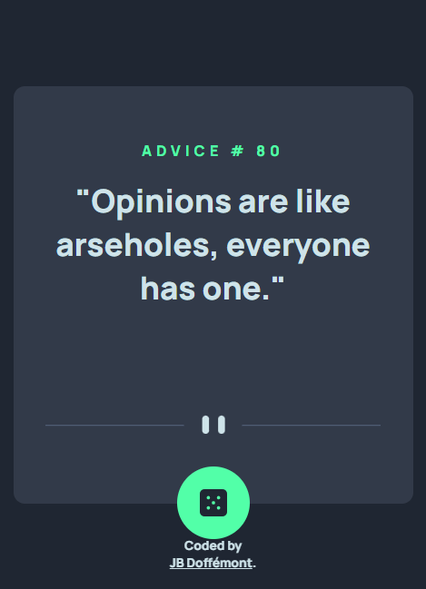

# Frontend Mentor - Advice generator app solution

## Table of contents

- [Overview](#overview)
  - [The challenge](#the-challenge)
  - [Screenshot](#screenshot)
  - [Links](#links)
  - [Built with](#built-with)
  - [What I learned](#what-i-learned)
- [Author](#author)

## Overview

### The challenge

Users should be able to:

- View the optimal layout for the app depending on their device's screen size
- See hover states for all interactive elements on the page
- Generate a new piece of advice by clicking the dice icon

### Screenshot

### Links

- Live Site URL: [Click here](https://advice-generator-app-xi.vercel.app/)

### Built with

- Semantic HTML5 markup
- CSS custom properties
- Mobile-first workflow
- Javascript
- Sass

### What I learned

- How to interact with 3third party API in Javascript
- Tried to improve my SASS

## Author

- Website - [JB Doffémont](https://github.com/JB-Doffemont)
- Frontend Mentor - [@JB-Doffemont](https://www.frontendmentor.io/profile/JB-Doffemont)
